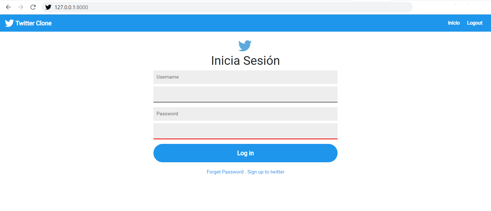

# Twitter Clone
This project is an early version of socialnetwork Twitter, in which you can create an user/profile, post and delete tweets, see the tweets of all users in the feed, go to another user's profile and follow/unfollow another accounts.

This project was made using Django and following the tutorial of the YouTube channel Mundo Python .

## How to install:
Using your shell, please follow the next steps:

**1. **  Clone the repository or download it as a zip.
`git clone https://github.com/wilsongg08/Twitter_clone`

**2. ** Create a virtual environment
`python -m venv socialenv`

**3.** Install dependencies/libraries in requirements.txt
`pip install -r requirements.txt`

**4.** Run the migrations.
`python manage.py makemigrations` 

`python manage.py migrate`

**5.** Create a superuser.
`python manage.py createsuperuser`

**6.** Run the server
`python manage.py runserver`

## How to use:

Once server is started, you just have to open your browser and go to your local host with port 8000 (check in the shell in which port the server is running).

Use the program as another socialnetwork, create an account, post tweets and delete them, follow other users...

